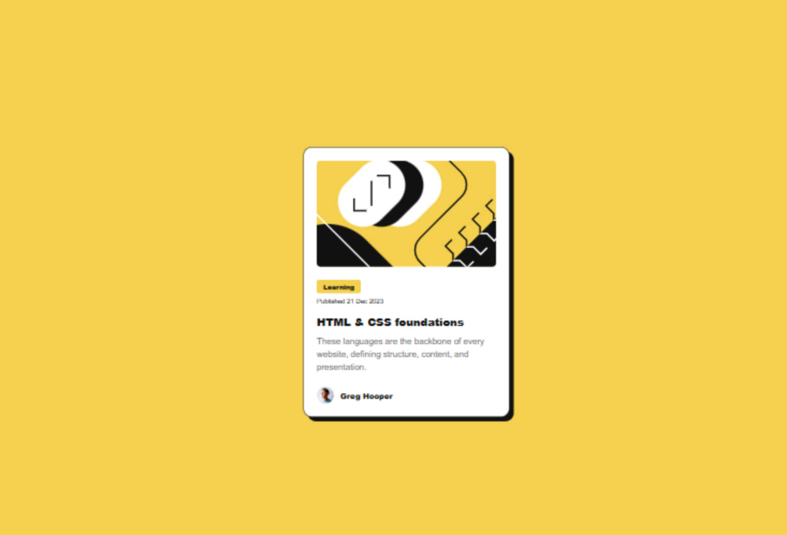

# Frontend Mentor - Blog preview card solution

This is a solution to the Blog preview card challenge on Frontend Mentor. Frontend Mentor challenges help you improve your coding skills by building realistic projects.

## Table of contents

- [Overview](#overview)
  - [The challenge](#the-challenge)
  - [Screenshot](#screenshot)
  - [Links](#links)
- [My process](#my-process)
  - [Built with](#built-with)
  - [What I learned](#what-i-learned)
  - [Continued development](#continued-development)
  - [Useful resources](#useful-resources)
- [Author](#author)
- [Acknowledgments](#acknowledgments)

## Overview

### The challenge

Users should be able to:

- See hover and focus states for all interactive elements on the page

### Screenshot

### Links

- Solution URL: [Add solution URL here](https://your-solution-url.com)
- Live Site URL: https://blog-preview-card-main-soln.netlify.app/

## My process

### Built with

- Semantic HTML5 markup
- CSS custom properties
- Flexbox
- 
- Mobile-first workflow

### What I learned

How to structure components semantically with clear separation of image, content, and footer.

The importance of hover and focus states for accessibility, including keyboard navigation.

Responsive design techniques for cards using flexible widths and max-widths.

Managing consistent spacing between elements using CSS margin and padding.

Using CSS variables for colors and fonts to keep styles maintainable and consistent.

.blog-card__title:hover,
.blog-card__title:focus {
  color: var(--yellow);
  outline: 2px solid var(--yellow);
  outline-offset: 3px;
}

### Continued development

Improve accessibility by adding more descriptive aria-labels and roles.

Experiment with CSS Grid to build more complex card layouts.

Practice advanced responsive techniques, including better image handling on mobile devices.

Refine focus styles with custom animations for better user experience

## Author

<!-- - Website - [Add your name here](https://www.your-site.com) -->
- Frontend Mentor – @Bensolve
- Twitter – @Benjaminkissa1,

## Acknowledgments
Thanks to the Frontend Mentor community and challenge creators for providing clear project briefs and inspiration to improve my frontend skills.